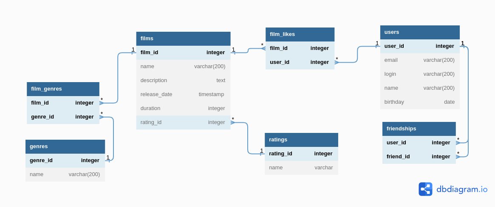

# java-filmorate

Template repository for Filmorate project.

## Application ERD



### SQL Examples

```postgresql
-- get all films
SELECT f.*,
       r.name as rating_name,
       array_agg(fg.genre_id) as genre_ids,
       array_agg(g.name) as genre_names,
       array_agg(DISTINCT fl.user_id) as likes
FROM films f
         LEFT JOIN film_genres fg ON fg.film_id = f.film_id
         LEFT JOIN genres g ON fg.genre_id = g.genre_id
         LEFT JOIN film_likes fl on f.film_id = fl.film_id
         LEFT JOIN ratings r on f.rating_id = r.rating_id
GROUP BY f.film_id, r.name;

-- get film by id
SELECT f.*,
       r.name as rating_name,
       array_agg(fg.genre_id) as genre_ids,
       array_agg(g.name) as genre_names,
       array_agg(DISTINCT fl.user_id) as likes
FROM films f
         LEFT JOIN film_genres fg ON fg.film_id = f.film_id
         LEFT JOIN genres g ON fg.genre_id = g.genre_id
         LEFT JOIN film_likes fl on f.film_id = fl.film_id
         LEFT JOIN ratings r on f.rating_id = r.rating_id
WHERE f.film_id = ?
GROUP BY f.film_id, r.name;

-- update film
UPDATE films SET
                 name = ?, description = ?, release_date = ?, duration = ?, rating_id = ?
WHERE film_id = ?;


-- get most popular films
SELECT f.*,
       r.name as rating_name,
       array_agg(fg.genre_id) as genre_ids,
       array_agg(g.name) as genre_names,
       array_agg(DISTINCT fl.user_id) as likes
FROM films f
         LEFT JOIN film_genres fg ON fg.film_id = f.film_id
         LEFT JOIN genres g ON fg.genre_id = g.genre_id
         LEFT JOIN film_likes fl on f.film_id = fl.film_id
         LEFT JOIN ratings r on f.rating_id = r.rating_id
GROUP BY f.film_id, r.name
ORDER BY array_length(array_agg(DISTINCT fl.user_id) FILTER (WHERE fl.user_id is not null)) DESC
LIMIT ?;


-- get all users
SELECT u.*, array_agg(f.friend_id) as friends FROM users u
                                                       LEFT JOIN friendships f ON u.user_id = f.user_id
GROUP BY u.user_id;

-- get user by id
SELECT u.*, array_agg(f.friend_id) as friends FROM users u
                                                       LEFT JOIN friendships f ON u.user_id = f.user_id
WHERE u.user_id = ?
GROUP BY u.user_id;

-- update user
UPDATE users SET
                 email = ?, login = ?, name = ?, birthday = ?
WHERE user_id = ?;

-- get friends of the user
SELECT u.*, array_agg(f2.friend_id) as friends
FROM friendships f
         INNER JOIN users u ON u.user_id = f.friend_id
         LEFT JOIN friendships f2 ON u.user_id = f2.user_id
WHERE f.user_id = ?
GROUP BY u.user_id;

-- get common friends of two users
SELECT u.*, array_agg(f.friend_id) as friends FROM users u
                                                       LEFT JOIN friendships f ON u.user_id = f.user_id
WHERE u.user_id IN (
    SELECT friend_id FROM friendships
    WHERE user_id = ?
    INTERSECT
    SELECT friend_id FROM friendships
    WHERE user_id = ?
)
GROUP BY u.user_id;
```
